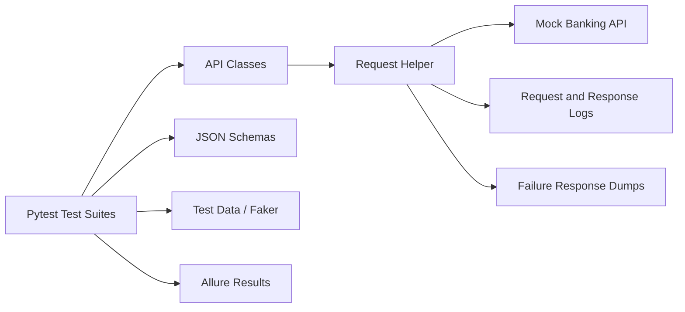

# Banking API Automation Framework

A production-style API automation framework for validating digital banking workflows using Python, Requests, Pytest, Allure Reports, JSON Schema Validation, Faker, logging, and a local Flask mock banking API.

This project is designed to look and behave like a real QA automation asset for a banking domain. It demonstrates reusable API clients, config-driven environments, data-driven testing, schema contracts, reporting, request/response logging, and negative scenario coverage.

## Tech Stack

| Area | Tooling |
| --- | --- |
| Language | Python |
| API Client | Requests |
| Test Runner | Pytest |
| Reporting | Allure Reports |
| Contract Testing | jsonschema |
| Test Data | Faker, JSON fixtures |
| Mock Service | Flask |
| Logging | Python logging |
| Design Style | Page Object Model-inspired API classes |

## Project Structure

```text
Banking-API-Automation-Framework/
|
|-- api/
|   |-- login_api.py
|   |-- account_api.py
|   |-- beneficiary_api.py
|   |-- transfer_api.py
|   `-- transaction_api.py
|
|-- tests/
|   |-- test_login.py
|   |-- test_account.py
|   |-- test_beneficiary.py
|   |-- test_transfer.py
|   `-- test_transaction.py
|
|-- schemas/
|   |-- login_schema.json
|   |-- account_schema.json
|   `-- transaction_schema.json
|
|-- utils/
|   |-- config_reader.py
|   |-- logger.py
|   |-- data_generator.py
|   |-- assertions.py
|   `-- request_helper.py
|
|-- mock_api/
|   `-- app.py
|
|-- config/
|   `-- config.json
|
|-- test_data/
|   `-- users.json
|
|-- reports/
|-- conftest.py
|-- requirements.txt
|-- pytest.ini
|-- .gitignore
`-- README.md
```

## Architecture



## Banking Coverage

The framework includes 30+ executable API test cases.

| Module | Coverage |
| --- | --- |
| Authentication | Valid login, invalid login, empty credentials, token validation, missing token, tampered token |
| Account | Account details, customer accounts, balance validation, invalid account lookup, unauthenticated access |
| Beneficiary | Add beneficiary, list beneficiaries, delete beneficiary, duplicate beneficiary, missing required fields |
| Fund Transfer | Successful transfer, balance update, transaction creation, insufficient balance, invalid amount, invalid account, frozen account |
| Transaction | Transaction history, transaction details, recent transactions, limit validation, transfer visibility, invalid transaction/account |

## Mock Banking API

The local Flask mock API avoids paid or external dependencies and supports:

- `POST /auth/login`
- `GET /auth/validate`
- `GET /accounts`
- `GET /accounts/{account_id}`
- `GET /accounts/{account_id}/balance`
- `GET /beneficiaries`
- `POST /beneficiaries`
- `DELETE /beneficiaries/{beneficiary_id}`
- `POST /transfers`
- `GET /accounts/{account_id}/transactions`
- `GET /accounts/{account_id}/transactions/recent`
- `GET /transactions/{transaction_id}`

By default, `conftest.py` starts the mock API automatically before tests and resets data before every test.

## Setup

```bash
python -m venv .venv
source .venv/bin/activate
pip install -r requirements.txt
```

Windows PowerShell:

```powershell
python -m venv .venv
.\.venv\Scripts\Activate.ps1
pip install -r requirements.txt
```

## Run Tests

Run the complete regression suite:

```bash
pytest
```

Run a specific module:

```bash
pytest tests/test_transfer.py
```

Run smoke tests:

```bash
pytest -m smoke
```

Run with a different environment:

```bash
TEST_ENV=qa pytest
```

Windows PowerShell:

```powershell
$env:TEST_ENV="qa"
pytest
```

## Allure Reports

Generate and open an Allure report:

```bash
pytest --alluredir=reports/allure-results
allure serve reports/allure-results
```

Generated artifacts:

- Allure results: `reports/allure-results/`
- Execution logs: `reports/logs/execution.log`
- Failure response dumps: `reports/response_dumps/`

## Sample Report Screenshot Placeholder

Add screenshots from your local Allure execution here when publishing to GitHub:

```text
docs/screenshots/allure-dashboard.png
docs/screenshots/allure-test-details.png
docs/screenshots/allure-failed-response-dump.png
```

## Config Management

Environment settings live in `config/config.json`.

```json
{
  "qa": {
    "base_url": "http://127.0.0.1:5001",
    "timeout": 10,
    "auto_start_mock_api": true
  }
}
```

Supported environment variables:

- `TEST_ENV`
- `BASE_URL`
- `REQUEST_TIMEOUT`
- `AUTO_START_MOCK_API`

## Design Highlights

- Page Object Model-inspired API classes for domain separation.
- Centralized request helper for HTTP methods, logging, Allure attachments, and response dumps.
- JSON schema validation for login, account, and transaction contracts.
- Data-driven tests with JSON fixtures and Faker-generated payloads.
- Isolated test execution through mock API reset hooks.
- Pytest markers for smoke, regression, negative, schema, and module-specific execution.
- GitHub-ready structure with `.gitignore`, clear documentation, and reproducible local execution.

## Default Test Users

```text
john.doe / SecurePass123!
jane.smith / SecurePass456!
```

